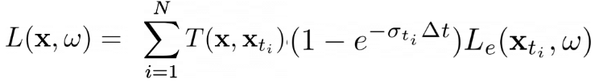

# Simple-Volumetric-Renderer-NeRF-Point Sampling-
<!DOCTYPE html>
<html lang="en">
<head>
    <meta charset="UTF-8">
    <meta name="viewport" content="width=device-width, initial-scale=1.0">
    <title>Test Results</title>
</head>
<body>


<h1>
Harshal Shirsath<br>
shirsath@umd.edu<br>
CMSC848F<br>
Assignment 4
</h1>
<h1>1. Classification Model </h1>
<h2>1.1 Test Accuracy for cls</h2>

<!-- Test Accuracy -->
<p>Test Accuracy: 0.9328436</p>

<h2>1.2 Ground Truth Point Clouds</h2>


<h2>1.3Predicted Point Clouds</h2>


<p>Test accuracy: 0.9328436516264428<br>
Object 609: Predicted Class = 0<br>
Object 361: Predicted Class = 0<br>
Object 495: Predicted Class = 0<br>
Object 887: Predicted Class = 2<br>
Object 294: Predicted Class = 0<br>
Failure Prediction for Class 0: Predicted Class = 2, True Class = 0.0<br>
Failure Prediction for Class 1: Predicted Class = 0, True Class = 1.0<br>
Failure Prediction for Class 2: Predicted Class = 1, True Class = 2.0<br>
</p>
<!-- Add more visualizations as needed -->

<!-- Failure Predictions -->
<h2>1.4 Failure Predictions</h2>
<h3>1.4.1. Chair</h3>


<p>Interpretation: It is able to predict ladder as a chair all because of it's 4 legs as seen in the model
    However, the ladder belongs to a different class and due to similar features like the legs of the chair
    It considers the object as a chair and not like a ladder.
</p>

<h3>1.4.2.Vase</h3>


<p>Interpretation: The vase presented as table cot may be due to the reason of points placed in a particular sequence 
    just as table and this is turning the prediction towards table as vase.
</p>

<h3>1.4.3. Lamp</h3>


<p>Interpretation: It considers globe as lamp since due to the quite similar similar shapes or appearance from certain viewpoints.
    Thus, it misclassifies these instances where the distinguishing features are not prominent across classes.
</p>


<h1>2.Segmentation Model </h1>
<h2>1.Test Accuracy for seg</h2>

Test Accuracy: 0.838523500


<h2>2.1 Ground Truth Seg Point Clouds</h2>

<h3>Ground Truth seg</h3>


<h2>2.2 Prediction Point Clouds</h2>
<h3>Predicted seg</h3>

<p> Prediction accuracy:0.9085 </p>

<p> Prediction accuracy: 0.8687 </p>

<p> Prediction accuracy: 0.9543</p>

<p> Prediction accuracy: 0.8812</p>

<p> Prediction accuracy: 0.567 </p>

<h2>2.3 Interpretation</h2>
<p> A segmentation model, loads a pre-trained checkpoint, and evaluates 
    its performance on
    randomly selected objects from a test dataset.
    For each object, it selects a subset of points, makes predictions, 
    calculates accuracy, and visualizes the segmentation results in terms 
    of ground truth and predicted labels. 
    The accuracy metrics demonstrate the model's effectiveness in segmenting 
    objects from the point cloud data, and the visualization provides insights
    into the segmentation quality for each selected object. The random selection 
    of objects allows for a diverse assessment of the model's generalization capabilities.</p>


</body>
</html>

<h1>3. Robustness Analysis</h1>
<h2>3.1. Describe the Procedure</h2>
<p>
1. Loading the labeled data (test_label and test_data)<br>
2. Initializing the segmentation and classification model<br>
3. Loading the pre-trained model checkpoint from a specified path for both segmentation and classification models<br>
4. Defining the rotate_point_cloud function to rotate the input point cloud by a specified angle (30 degrees in this case) for both classification and segmentation<br>
5. Creating visualization directories<br>
6. Rotating and predicting after rotating the dataset by 30 degrees using the rotate_point_cloud function<br>
7. Obtaining model predictions for every batch<br>
8. Visualizing ground truth, predicted segmentation, and classification results and saving them<br>
9. Computing test accuracy based on the predicted labels and ground truth labels<br>
</p>

<h2>3.2. Test accuracy and Visualization</h2>
<h3>Classification </h3>

<p> Test accuracy:0.9085 </p>

<p> Prediction accuracy: 0.8687 </p>

<p> Prediction accuracy: 0.9543</p>

<p> Prediction accuracy: 0.8812</p>

<p> Prediction accuracy: 0.567 </p>
<h2>3.3. Comparison</h2>
<p>

<h3>Classification Task:</h3>
In a classification task, the goal is to assign a single label to the entire input<br>
point cloud. Therefore, the colors in the visualization represent the predicted class <br>
labels for the entire object. Since each object is assigned a single label, all parts <br>
of the object are visualized with the same color. The goal is to determine the overall<br>
category of the object rather than identifying specific parts

<h3>Segmentation Task:</h3>
In a segmentation task, the goal is to assign a label to each point in the input point<br>
cloud, effectively segmenting the object into different parts. In the visualization, <br>
different colors are used to represent different segmented parts of the object. This <br>
allows for a more detailed understanding of the object's structure, <br>
as each color corresponds to a specific segment or part.<br>


Classification: If the classification results show similar colors for the entire object,<br>
it indicates that the model is focusing on the overall category or class of the object.<br>


Segmentation: If the segmentation results show variations in colors for different parts of <br>
the object, it suggests that the model is successfully segmenting the object into 
distinct regions or components.
</p>

<h2>3.4 Interpretation</h2>
<p> The classification results, as visualized in the provided code, show objects with uniform
    colors, indicating that the model is successfully assigning overall class labels to the<br>
    entire point clouds. In contrast, the segmentation results exhibit a rich variety of colors,<br>
    signifying the model's ability to discern and categorize different parts of the objects. <br>
    This distinction underscores the nature of each task: classification focuses on identifying<br>
    the general category of an object, while segmentation delves into the detailed recognition<br>
    of individual components within the object. The visualizations thus align with the inherent <br>
    objectives and outcomes of classification and segmentation tasks in point cloud analysis.</p>


**Credit**: This assignment is modified from [CMU 3D Vision course](https://learning3d.github.io/).
**Credit**: This assignment is modified from [CMU 3D Vision course](https://learning3d.github.io/).

# Description
In this assignment, you will implement a simple volumetric renderer.

##  0. Setup

### 0.1 Environment setup
You can use the python environment you've set up for past assignments, or re-install it with our `environment.yml` file:

```bash
conda env create -f environment.yml
conda activate l3d
```

If you do not have Anaconda, you can quickly download it [here](https://docs.conda.io/en/latest/miniconda.html), or via the command line in with:

```bash
wget https://repo.anaconda.com/miniconda/Miniconda3-latest-Linux-x86_64.sh
chmod +x Miniconda3-latest-Linux-x86_64.sh
bash Miniconda3-latest-Linux-x86_64.sh
```

### 0.2 Data

The data for this assignment is provided in the github repo under `data/`. You do not need to download anything yourself.

##  1. Differentiable Volume Rendering

In the emission-absorption (EA) model described in class, volumes are typically described by their *appearance* (e.g. emission) and *geometry* (absorption) at *every point* in 3D space. For part 1 of the assignment, you will implement a ***Differentiable Renderer*** for EA volumes, which you will use in parts 2 and 3. Differentiable renderers are extremely useful for 3D learning problems --- one reason is because they allow you to optimize scene parameters (i.e. perform inverse rendering) from image supervision only!

##  1.1. Familiarize yourself with the code structure

There are four major components of our differentiable volume rendering pipeline:

* ***The camera***: `pytorch3d.CameraBase`
* ***The scene***: `SDFVolume` in `implicit.py`
* ***The sampling routine***: `StratifiedSampler` in `sampler.py`
* ***The renderer***: `VolumeRenderer` in `renderer.py`

`StratifiedSampler` provides a method for sampling multiple points along a ray traveling through the scene (also known as *raymarching*). Together, a sampler and a renderer describe a rendering pipeline. Like traditional graphics pipelines, this rendering procedure is independent of the scene and camera.

The scene, sampler, and renderer are all packaged together under the `Model` class in `main.py`. In particular the `Model`'s forward method invokes a `VolumeRenderer` instance with a sampling strategy and volume as input.

Also, take a look at the `RayBundle` class in `ray_utils.py`, which provides a convenient wrapper around several inputs to the volume rendering procedure per ray.

##  1.2. Outline of tasks

In order to perform rendering, you will implement the following routines:

1. **Ray sampling from cameras**: you will fill out methods in `ray_utils.py` to generate world space rays from a particular camera.
2. **Point sampling along rays**: you will fill out the `StratifiedSampler` class to generate sample points along each world space ray
3. **Rendering**: you will fill out the `VolumeRenderer` class to *evaluate* a volume function at each sample point along a ray, and aggregate these evaluations to perform rendering.

##  1.3. Ray sampling

Take a look at the `render_images` function in `main.py`. It loops through a set of cameras, generates rays for each pixel on a camera, and renders these rays using a `Model` instance.

### Implementation

Your first task is to implement:

1. `get_pixels_from_image` in `ray_utils.py` and
2. `get_rays_from_pixels` in `ray_utils.py`

which are used in `render_images`:

```python
xy_grid = get_pixels_from_image(image_size, camera) # TODO: implement in ray_utils.py
ray_bundle = get_rays_from_pixels(xy_grid, camera) # TODO: implement in ray_utils.py
```

The `get_pixels_from_image` method generates pixel coordinates, ranging from `[-1, 1]` for each pixel in an image. The `get_rays_from_pixels` method generates rays for each pixel, by mapping from a camera's *Normalized Device Coordinate (NDC) Space* into world space.

### Visualization

You can run the code for part 1 with:

```bash
python main.py --config-name=box
```

Once you have implemented these methods, verify that your output matches the TA output by visualizing both `xy_grid` and `rays` with the `vis_grid` and `vis_rays` functions in the `render_images` function in `main.py`. **By default, the above command will crash and return an error**. However, it should reach your visualization code before it does. The outputs of grid/ray visualization should look like this:

             


    

##  1.4. Point sampling

### Implementation

Your next task is to fill out `StratifiedSampler` in `sampler.py`. Implement the forward method, which:

1. Generates a set of distances between `near` and `far` and
2. Uses these distances to sample points offset from ray origins (`RayBundle.origins`) along ray directions (`RayBundle.directions`).
3. Stores the distances and sample points in `RayBundle.sample_points` and `RayBundle.sample_lengths`

### Visualization

Once you have done this, use the `render_points` method in `render_functions.py` in order to visualize the point samples from the first camera. They should look like this:


##  1.5. Volume rendering

Finally, we can implement volume rendering! With the `configs/box.yaml` configuration, we provide you with an `SDFVolume` instance describing a box. You can check out the code for this function in `implicit.py`, which converts a signed distance function into a volume. If you want, you can even implement your own `SDFVolume` classes by creating new signed distance function class, and adding it to `sdf_dict` in `implicit.py`. Take a look at [this great web page](https://www.iquilezles.org/www/articles/distfunctions/distfunctions.htm) for formulas for some simple/complex SDFs.


### Implementation

You will implement

1. `VolumeRenderer._compute_weights` and
2. `VolumeRenderer._aggregate`.
3. You will also modify the `VolumeRenderer.forward` method to render a depth map in addition to color from a volume

From each volume evaluation you will get both volume density, and a color:

```python
# Call implicit function with sample points
implicit_output = implicit_fn(cur_ray_bundle)
density = implicit_output['density']
feature = implicit_output['feature']
```

You'll then use the following equation to render color along a ray:



where `σ` is density, `Δt` is the length of current ray segment, and `L_e` is color:


Compute the weights `T * (1 - exp(-σ * Δt))` in `VolumeRenderer._compute_weights`, and perform the summation in `VolumeRenderer._aggregate`. Note that for the first segment `T = 1`. (Hint: using torch.cumprod would be useful in computing the transmittance)

Use weights, and aggregation function to render *color* and *depth* (stored in `RayBundle.sample_lengths`). 

### Visualization

By default, your results will be written out to `images/part_1.gif`. Provide a visualization of the depth in your write-up.

  


##  2. Optimizing a basic implicit volume

##  2.1. Random ray sampling

Since you have now implemented a differentiable volume renderer, we can use it to optimize the parameters of a volume! We have provided a basic training loop in the `train` method in `main.py`.

Depending on how many sample points we take for each ray, volume rendering can consume a lot of memory on the GPU (especially during the backward pass of gradient descent). Because of this, it usually makes sense to sample a subset of rays from a full image for each training iteration. In order to do this, implement the `get_random_pixels_from_image` method in `ray_utils.py`, invoked here:

```python
xy_grid = get_random_pixels_from_image(cfg.training.batch_size, image_size, camera) # TODO: implement in ray_utils.py
```

##  2.2. Loss and training
Replace the loss in `train`

```python
loss = None
```

with mean squared error between the predicted colors and ground truth colors `rgb_gt`.

Once you've done this, you can run train a model with

```bash
python main.py --config-name=train_box
```

This will optimize the position and side lengths of a box, given a few ground truth images with known camera poses (in the `data` folder). Report the center of the box, and the side lengths of the box after training, rounded to the nearest `1/100` decimal place.

##  2.3. Visualization

The code renders a spiral sequence of the optimized volume in `images/part_2.gif`. Compare this gif to the one below, and attach it in your write-up:


##  3. Optimizing a Neural Radiance Field (NeRF)
In this part, you will implement an implicit volume as a Multi-Layer Perceptron (MLP) in the `NeuraRadianceField` class in `implicit.py`. This MLP should map 3D position to volume density and color. Specifically:

1. Your MLP should take in a `RayBundle` object in its forward method, and produce color and density for each sample point in the RayBundle.
2. You should also fill out the loss in `train_nerf` in the `main.py` file.

You will then use this implicit volume to optimize a scene from a set of RGB images. We have implemented data loading, training, checkpointing for you, but this part will still require you to do a bit more legwork than for Parts 1 and 2. You will have to write the code for the MLP yourself --- feel free to reference the NeRF paper, though you should not directly copy code from an external repository.

## Implementation

Here are a few things to note:

1. For now, your NeRF MLP does not need to handle *view dependence*, and can solely depend on 3D position.
2. You should use the `ReLU` activation to map the first network output to density (to ensure that density is non-negative)
3. You should use the `Sigmoid` activation to map the remaining raw network outputs to color
4. You can use *Positional Encoding* of the input to the network to achieve higher quality. We provide an implementation of positional encoding in the `HarmonicEmbedding` class in `implicit.py`.

## Visualization
You can train a NeRF on the lego bulldozer dataset with

```bash
python main.py --config-name=nerf_lego
```

This will create a NeRF with the `NeuralRadianceField` class in `implicit.py`, and use it as the `implicit_fn` in `VolumeRenderer`. It will also train a NeRF for 250 epochs on 128x128 images.

Feel free to modify the experimental settings in `configs/nerf_lego.yaml` --- though the current settings should allow you to train a NeRF on low-resolution inputs in a reasonable amount of time. After training, a spiral rendering will be written to `images/part_3.gif`. Report your results. It should look something like this:


